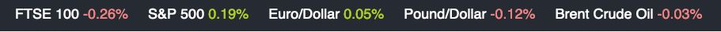

## Customer Products

This is an exercise to fetch securities data and use it to populate a client-side component with their percentage change for the day.

## Getting started

1. Clone the project with **git clone**
2. Install the dependencies with **npm install**
3. Start the app with **npm start**
4. Run the tests with **npm test**

## HTTP Request

- GET https://markets-data-api-proxy.ft.com/research/webservices/securities/v1/quotes

## URL Query Parameters

### The following symbols are the securities to display:

#### Security Symbol

- FTSE 100 -> FTSE:FSI
- S&P 500 -> INX:IOM
- Euro/Dollar -> EURUSD
- Pound/Dollar -> GBPUSD
- Brent Crude Oil -> IB.1:IEU

 

